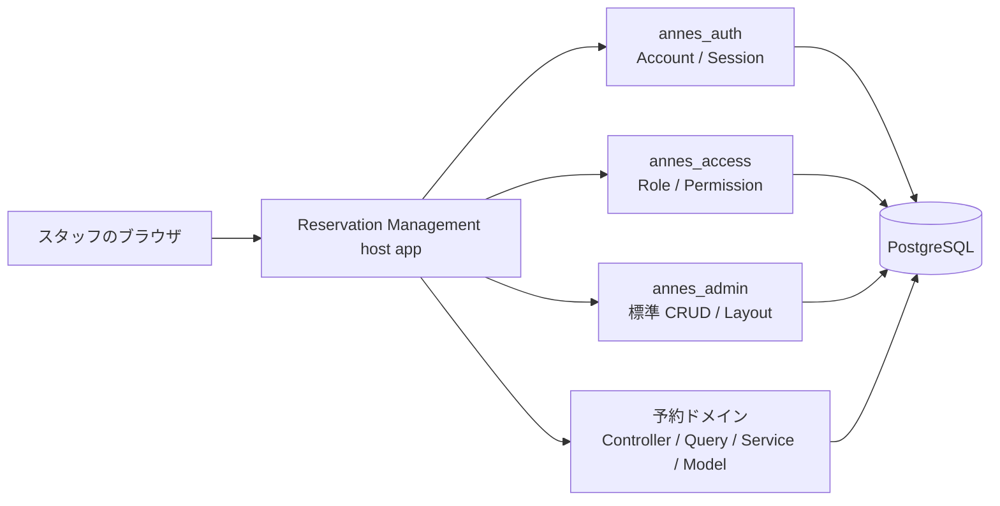
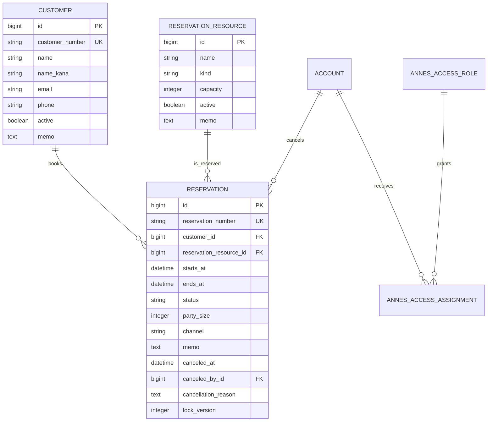
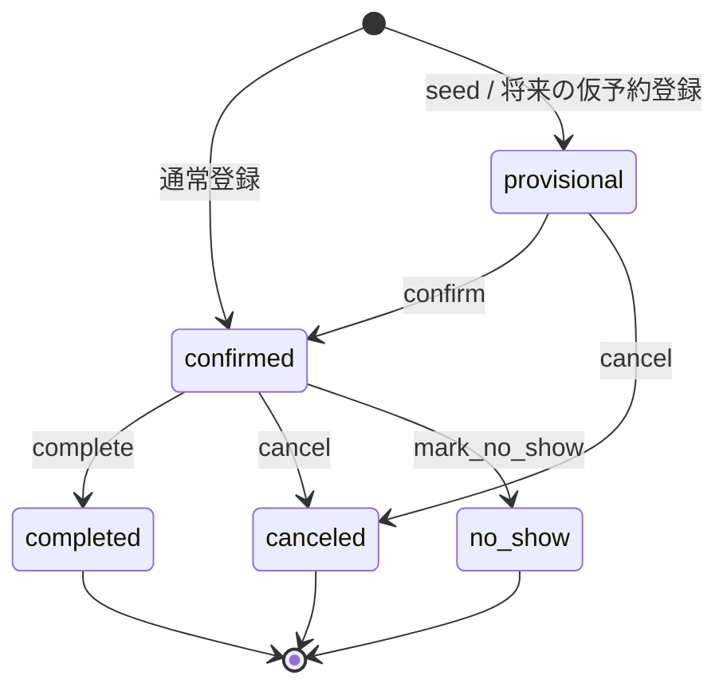

# 予約管理 example 基本設計

- Type: design
- Date: 2026-07-13
- Status: Implemented
- Target: `examples/resavation_management`
- Input: [要件定義](requirements.md)

## 1. アーキテクチャ



### 責務分担

| 領域 | 実装先 |
| --- | --- |
| Account、session、login helper | `annes_auth` |
| role、permission、assignment | `annes_access` |
| 顧客・予約対象の標準 CRUD | `annes_admin` |
| 予約モデルと業務ルール | host app |
| 日別スケジュールと複合 filter | host app |
| 状態遷移と重複エラー処理 | host app service |
| FK、check、重複排他 | PostgreSQL |

予約画面は日時入力、複合 filter、状態遷移、競合応答が必要なため、AnnesAdmin 標準 CRUD ではなく host controller/view で実装する。

## 2. 技術構成

- Ruby 3.4.9
- Rails 8.1.x
- PostgreSQL
- Minitest
- ERB と host stylesheet
- AASM 5.5.2
- monorepo 内 path gem の `annes_auth`、`annes_access`、`annes_admin`

application time zone は Tokyo、Active Record の保存基準は UTC とする。

```ruby
config.time_zone = "Tokyo"
config.active_record.default_timezone = :utc
```

## 3. ドメインモデル



### Customer

- `has_many :reservations, dependent: :restrict_with_error`
- `customer_number` は `C-XXXXXXXX` 形式で自動採番する。
- name は必須。
- email は任意。値がある場合は形式検証する。
- inactive customer は新規予約で選択不可とする。

### ReservationResource

- `has_many :reservations, dependent: :restrict_with_error`
- kind は `facility`、`room`、`equipment`、`staff`、`other`。
- capacity は1以上。
- inactive resource は新規予約で選択不可とする。
- capacity を将来の blocking 予約の人数未満へ変更できない。

### Reservation

```ruby
belongs_to :customer
belongs_to :reservation_resource
belongs_to :canceled_by, class_name: "Account", optional: true
```

```ruby
STATUSES = %w[provisional confirmed completed canceled no_show].freeze
BLOCKING_STATUSES = %w[provisional confirmed].freeze
CHANNELS = %w[phone email counter web other].freeze
```

DB 値は英語 key とし、日本語表示は locale または label map で行う。

## 4. Database

### customers

| Column | Type | Constraint |
| --- | --- | --- |
| customer_number | string | null false、unique |
| name | string | null false、index |
| name_kana | string | index |
| email | string | index |
| phone | string | index |
| active | boolean | null false、default true、index |
| memo | text |  |
| timestamps | datetime | null false |

email は家族・共通窓口で共有される可能性があるため一意にしない。

### reservation_resources

| Column | Type | Constraint |
| --- | --- | --- |
| name | string | null false、index |
| kind | string | null false、known-value check |
| capacity | integer | null false、default 1、`>= 1` check |
| active | boolean | null false、default true、index |
| memo | text |  |
| timestamps | datetime | null false |

### reservations

| Column | Type | Constraint |
| --- | --- | --- |
| reservation_number | string | null false、unique |
| customer_id | bigint | null false、FK |
| reservation_resource_id | bigint | null false、FK |
| starts_at | datetime | null false |
| ends_at | datetime | null false、`ends_at > starts_at` check |
| status | string | null false、default confirmed、known-value check |
| party_size | integer | null false、default 1、`>= 1` check |
| channel | string | null false、default other、known-value check |
| memo | text |  |
| canceled_at | datetime | canceled の場合必須 |
| canceled_by_id | bigint | accounts FK、canceled の場合必須 |
| cancellation_reason | text | canceled の場合のみ設定可 |
| lock_version | integer | null false、default 0 |
| timestamps | datetime | null false |

推奨 index:

```ruby
add_index :reservations, :reservation_number, unique: true
add_index :reservations, [:reservation_resource_id, :starts_at]
add_index :reservations, [:status, :starts_at]
add_index :reservations, [:customer_id, :starts_at]
add_index :reservations, :ends_at
```

### 重複予約制約

Rails の datetime は PostgreSQL の timestamp without time zone に UTC 値を保持する構成のため、`tsrange` を使う。

```ruby
enable_extension "btree_gist" unless extension_enabled?("btree_gist")

add_exclusion_constraint :reservations,
  "reservation_resource_id WITH =, tsrange(starts_at, ends_at, '[)') WITH &&",
  using: :gist,
  where: "status IN ('provisional', 'confirmed')",
  name: "reservations_no_blocking_time_overlap"
```

`[)` により、10:00–11:00 と 11:00–12:00 の連続予約を許可する。

## 5. 状態遷移



- provisional / confirmed だけ通常属性を編集できる。
- complete / no_show は開始時刻経過後だけ許可する。
- canceled への遷移時に actor、時刻、理由を同一 transaction で保存する。
- terminal 状態からの復帰は提供しない。
- status は通常 edit form の select に含めない。
- 状態とevent/guard/callbackの正本は`Reservation` modelのAASM state machineとする。

## 6. Application Layer

### Controller

`Admin::BaseController < AnnesAdmin::ApplicationController` とし、`AnnesAccess::Authorization` を include する。AnnesAdmin の認証 hook、CSRF、layout を利用し、予約 action は `authorize_access!` で直接認可する。

### Query

`Reservations::Filter` が次を処理する。

- date。既定値 `Time.zone.today`
- reservation resource
- status。既定では canceled を除外
- customer / reservation number keyword
- page / per_page。最大100

日別抽出は時間帯の交差を使う。

```ruby
day_start = date.in_time_zone.beginning_of_day
day_end = day_start.next_day

scope.where("starts_at < ? AND ends_at > ?", day_end, day_start)
```

### Services

| Service | Responsibility |
| --- | --- |
| `Reservations::Create` | 採番、validation、保存、DB競合の変換 |
| `Reservations::Update` | terminal 拒否、locking、重複再検証 |
| `Reservations::Transition` | AASM eventの実行、locking、domain errorへの変換 |

DB の exclusion violation は constraint 名を確認して `Reservations::ConflictError` に変換する。未知の DB error は握り潰さない。

## 7. Routes

host route を AnnesAdmin mount より前に定義する。

```ruby
Rails.application.routes.draw do
  root to: redirect("/admin/reservations/schedule")

  namespace :admin do
    get "home", to: redirect("/admin/reservations/schedule"), as: :root
    get "login", to: "sessions#new"
    post "session", to: "sessions#create"
    delete "logout", to: "sessions#destroy"

    get "reservations/schedule",
      to: "reservations#schedule",
      as: :reservation_schedule

    resources :reservations, except: :destroy do
      member do
        get "cancel", action: :cancel_confirmation, as: :cancel_confirmation
        patch "cancel", action: :cancel, as: :cancel
        patch :confirm
        patch :complete
        patch :mark_no_show
      end
    end
  end

  mount AnnesAdmin::Engine => "/admin", as: :annes_admin
end
```

## 8. Screens

### 日別スケジュール

- 前日／今日／翌日の移動
- 日付、予約対象、状態、キーワード filter
- 開始・終了、予約番号、顧客、予約対象、人数、状態の表
- 新規予約導線
- canceled の識別表示
- empty state

### 予約 form

AnnesAdmin の現在の datetime field は時刻入力を提供しないため、host 専用 form を使う。

- active customer select
- active reservation resource select
- starts_at / ends_at の `datetime-local`
- party_size
- channel
- memo
- 編集時の hidden `lock_version`

### 予約詳細

- 予約情報と取消情報
- 状態と権限に応じた edit/confirm/cancel/complete/no-show button
- 状態操作 form の hidden `lock_version`

### 顧客・予約対象

AnnesAdmin resource DSL を使い、index/show/new/create/edit/update だけを公開する。destroy は公開しない。

## 9. Authorization

| Permission | admin | operator | viewer |
| --- | --- | --- | --- |
| customers.manage | ✓ |  |  |
| customers.read |  | ✓ | ✓ |
| customers.create |  | ✓ |  |
| customers.update |  | ✓ |  |
| reservation_resources.manage | ✓ |  |  |
| reservation_resources.read |  | ✓ | ✓ |
| reservations.manage | ✓ | ✓ |  |
| reservations.read |  |  | ✓ |
| reservations.confirm | ✓ | ✓ |  |
| reservations.cancel | ✓ | ✓ |  |
| reservations.complete | ✓ | ✓ |  |
| reservations.no_show | ✓ | ✓ |  |

AnnesAccess の manage は標準 action だけに展開されるため、状態操作 permission は個別に seed する。

## 10. Concurrency and Errors

### 二段階の重複防止

1. model validation が通常の重複を検出して form error を返す。
2. exclusion constraint が並行 request の競合を防ぐ。

### Optimistic Locking

- update と状態操作に form の `lock_version` を渡す。
- `ActiveRecord::StaleObjectError` を HTTP 409 へ変換する。
- 自動 retry で利用者入力を上書きしない。

### HTTP Response

| Condition | Status |
| --- | --- |
| validation error | 422 |
| model 検出の重複 | 422 |
| DB 検出の並行重複 | 409 |
| stale object | 409 |
| 不正な状態遷移 | 422 |
| 未認証 | login redirect |
| 権限なし | 403 |
| record なし | 404 |

## 11. File Layout

```text
examples/resavation_management/
├── README.md
├── docs/
│   ├── requirements.md
│   └── design.md
├── app/
│   ├── admin/resources/
│   ├── controllers/admin/
│   ├── models/
│   ├── queries/reservations/
│   ├── services/reservations/
│   └── views/admin/reservations/
├── config/initializers/
├── db/migrate/
├── db/seeds.rb
└── test/
```

上記構成でhost appを実装し、予約固有のcontroller/view/query/service/modelをexample内に閉じ込める。

## 12. Test Design

### Model

- 必須、enum、email、capacity、時刻順、日跨ぎ
- party size と capacity
- active customer/resource
- 重複の全境界
- cancellation fields
- terminal edit 拒否

### Service

- create/update 成功と失敗
- DB conflict の変換
- 全状態遷移
- cancel の atomic update
- future reservation の complete/no-show 拒否
- stale lock version

### Query

- Tokyo の日付境界
- 日付との交差
- filter の単独・組み合わせ
- canceled の既定除外
- sort、pagination、最大件数

### Request

- 未認証 redirect
- 権限 matrix
- host route の優先
- 422/403/404/409
- button visibility

### Database

- 別 connection の同時予約で一方だけ成功する。
- `db:schema:load` で extension と exclusion constraint を再現する。
- seed を複数回実行できる。

## 13. Seed

- admin/operator/viewer Account と role assignment
- active/inactive customer
- room/equipment/inactive reservation resource
- confirmed/canceled/completed/no-show/provisional reservation
- 同一対象の連続予約

時刻は `Time.zone` と実行日基準で組み立て、reservation number をキーに冪等化する。

## 14. Security

- 全業務 route で認証・認可を実行する。
- strong parameter から status、採番、取消 actor を除外する。
- CSRF protection を維持する。
- 個人情報と認証情報を log へ出さない。
- raw DB error を画面へ表示しない。
- 本番では secure cookie と共有 rate-limit cache を設定する。

## 15. Design Decisions

- 予約は AnnesAdmin 標準 CRUD ではなく host workflow とする。
- model validation だけでなく DB exclusion constraint を使う。
- 座席在庫型を MVP に含めない。
- 顧客 party model は複製せず、簡易 Customer とする。
- 予約、顧客、予約対象の履歴を cascade delete しない。
- 永続監査履歴は P1 とし、MVP は取消 actor と時刻を保存する。
