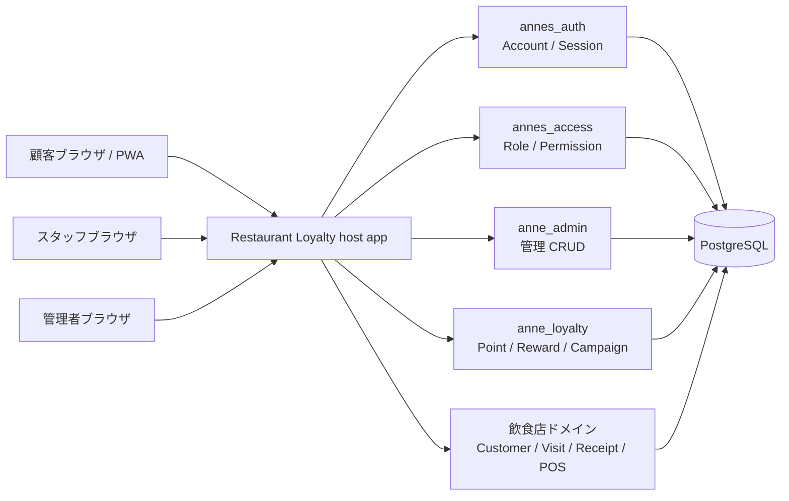
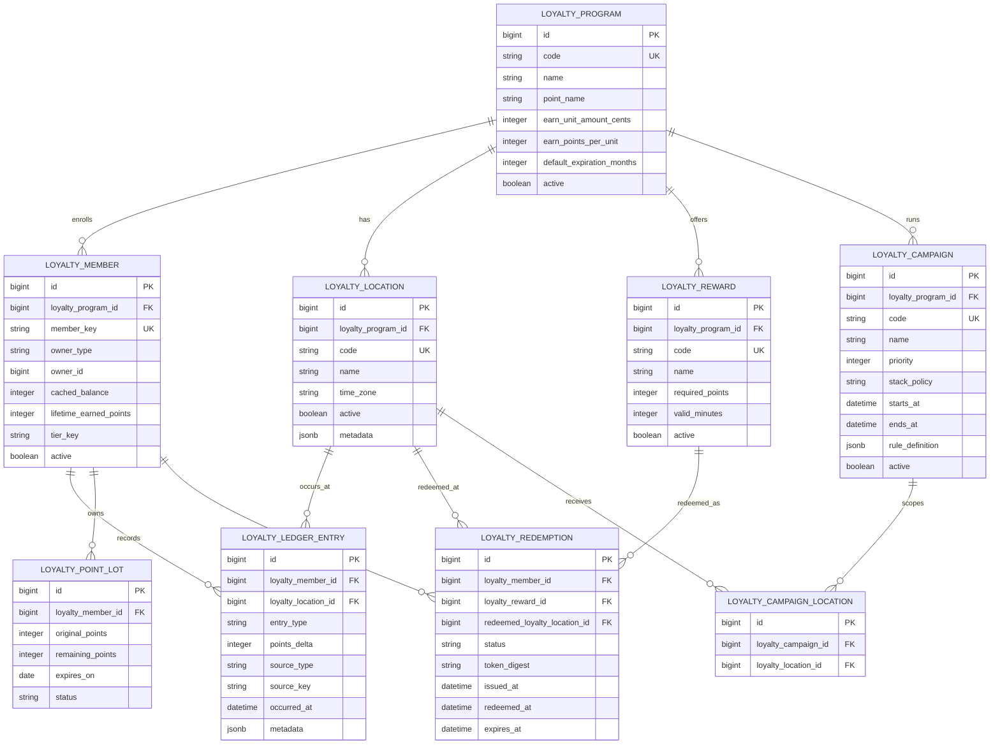

# 飲食店ポイントカード demo 技術構想

- Type: technical concept
- Date: 2026-07-26
- Status: Plan 1 MVP implemented
- Target: `anne_loyalty` engine and `examples/restaurant_loyalty`

## 0. 実装ステータス

2026-07-26時点で、Plan 1 MVPとして次を実装済み。

- `anne_loyalty` engine skeleton、public API、migration、model、service、test
- program、location、member、ledger entry、point lot、reward、redemption
- 基本付与、残高取得、FIFO lot消費、取消entry、冪等付与
- redemption tokenの発行、HMAC digest保存、期限・状態・location検証、一度きり利用
- 飲食店demo appの顧客画面、スタッフ会員検索、ポイント付与、特典利用確定
- 顧客画面のsession認証。表示対象はログイン済み顧客のみで、`customer_id` queryでは切り替えない
- AnneAdminでのprogram、location、reward管理
- admin / manager / staff / viewerのseed権限、demo seed、受け入れtest、CI selector

未実装の将来項目: campaign evaluator、point expiration batch、rank / tier、集計report、POS import adapter、camera QR scan、PWA、offline対応、push/メール通知。

## 1. 目的

飲食店の紙のポイントカードを置き換える demo app を題材に、ポイント付与・利用・失効・特典交換の中核ロジックを再利用可能な Rails engine として切り出す。

demo app は飲食店向けの具体的な顧客体験とスタッフ操作を見せる。engine は飲食店以外の小売、施設、会員制サービスでも使えるポイント基盤として設計する。

## 2. 基本方針

### 切り出すもの

`anne_loyalty` はポイントの整合性、監査性、再利用性に関わる責務を持つ。

- ポイントプログラムの定義
- 複数店舗・拠点とポイントプログラムの適用範囲
- 会員ごとのポイント残高
- ポイント付与、利用、失効、取消の ledger
- 特典と交換条件
- キャンペーンによる付与ポイント計算
- 冪等な外部イベント処理
- スタッフ操作の監査ログに必要な記録

### host app に残すもの

飲食店 demo app は店舗固有の体験、画面、業務フローを持つ。

- 顧客、会計、来店履歴などの飲食店ドメイン
- POS 設定、営業情報などの店舗運用詳細
- 顧客向けポイントカード画面
- スタッフ向け QR 読み取り・会計入力画面
- レシート、POS、注文管理との接続
- 店舗固有の文言、デザイン、キャンペーン訴求

### 決定事項

- `LoyaltyMember` と host app の顧客 model は polymorphic association で接続する。
- 複数店舗・拠点は将来的に `anne_loyalty` で扱う。初期 demo は 1 店舗でも、engine の model は multi-location を前提にする。
- キャンペーン条件は拡張性を優先し、固定 enum だけではなく versioned JSON rule と condition/effect registry で表現する。
- 顧客向け画面は初期実装では Rails View で作る。PWA 化は次フェーズ以降に回す。
- token の発行、digest 保存、検証、一度きり利用の状態遷移は `anne_loyalty` に置く。QR 読み取り画面とスタッフ操作 UI は host app に置く。

## 3. 全体アーキテクチャ



飲食店固有の controller/view は host app に置き、ポイント計算や残高更新は `anne_loyalty` の service API 経由で行う。

## 4. 想定エンジン境界

| 領域 | 実装先 | 理由 |
| --- | --- | --- |
| ログイン、session | `annes_auth` | 既存 engine の責務 |
| staff role、permission | `annes_access` | 既存 engine の責務 |
| プログラム・店舗・特典・キャンペーン管理 | `anne_admin` + `anne_loyalty` model | 標準 CRUD で管理可能 |
| ポイント残高、ledger、失効 | `anne_loyalty` | 再利用と整合性が重要 |
| redemption token の発行・検証 | `anne_loyalty` | 二重利用防止と監査性が重要 |
| QR 提示・読み取り UI | host app | 業態ごとに体験が変わる |
| 会計・注文・来店 | host app | POS や店舗運用に依存 |
| push 通知、メール配信 | host app or future engine | 初期 scope では外す |

Plan 1 MVPではcampaign model/evaluatorとreportsは未実装。管理画面はprogram、location、rewardのCRUDに限定する。

## 5. ドメインモデル案



### LoyaltyProgram

ポイント制度そのものを表す。飲食店 demo では 1 ブランド 1 プログラムで開始するが、将来的に複数ブランドや複数店舗グループを扱える形にする。

初期設定例:

- `point_name`: `pt`
- `earn_unit_amount_cents`: `100`
- `earn_points_per_unit`: `1`
- `default_expiration_months`: `12`

### LoyaltyLocation

ポイントプログラム配下の店舗・拠点を表す。飲食店 demo では店舗として表示するが、engine としては小売店、施設、窓口などにも使えるように `location` と呼ぶ。

ポイント残高は program 内で共有する。location は付与、利用、キャンペーン適用範囲、集計軸として使う。

初期 demo は 1 location で開始してよい。ただし service API と table は `location` を受け取れる形にし、後から複数店舗対応を足すための migration を避ける。

### LoyaltyMember

host app の顧客とポイントプログラムの参加状態をつなぐ。`owner_type` / `owner_id` による polymorphic association とする。

```ruby
belongs_to :owner, polymorphic: true
```

推奨制約:

```ruby
add_index :loyalty_members, [:owner_type, :owner_id]
add_index :loyalty_members,
  [:loyalty_program_id, :owner_type, :owner_id],
  unique: true,
  name: "index_loyalty_members_on_program_and_owner"
add_index :loyalty_members,
  [:loyalty_program_id, :member_key],
  unique: true,
  name: "index_loyalty_members_on_program_and_member_key"
```

`cached_balance` は表示と検索のために保持する。ただし正は `loyalty_point_lots.remaining_points` と ledger から再計算できるようにする。

### LoyaltyLedgerEntry

ポイントの事実を append-only で記録する。

`entry_type` の初期候補:

- `earn`: 付与
- `redeem`: 利用
- `expire`: 失効
- `adjust`: 手動調整
- `reverse`: 取消

`source_type` と `source_key` により、同じ会計・同じ外部イベントが二重に処理されないようにする。

推奨制約:

```ruby
add_index :loyalty_ledger_entries,
  [:loyalty_member_id, :source_type, :source_key],
  unique: true,
  where: "source_type IS NOT NULL AND source_key IS NOT NULL",
  name: "index_loyalty_ledger_entries_on_idempotency_key"
```

### LoyaltyPointLot

ポイント失効を正しく扱うため、付与単位で lot を作る。利用時は期限の近い lot から消費する。

demo の初期実装で失効処理を画面化しない場合でも、lot 構造は先に入れておく。後から ledger だけで失効期限を復元する実装は複雑になりやすい。

### LoyaltyReward / LoyaltyRedemption

特典定義と、会員が特典を交換した事実を分ける。

特典交換時は短時間有効な token を発行し、QR には生 token のみを載せる。DB には digest を保存する。スタッフ画面で token を検証し、`issued` から `redeemed` へ一度だけ遷移させる。

## 6. Service API 案

host app は model を直接更新せず、`anne_loyalty` の command service を呼ぶ。

```ruby
AnneLoyalty.enroll!(
  program: program,
  owner: customer,
  member_key: customer.customer_number
)

AnneLoyalty.quote_earn(
  member: member,
  location: location,
  amount_cents: 3200,
  occurred_at: Time.current,
  context: {weather: "rain"}
)

AnneLoyalty.earn!(
  member: member,
  location: location,
  amount_cents: 3200,
  source: receipt,
  occurred_at: Time.current,
  actor: current_account
)

AnneLoyalty.redeem_reward!(
  member: member,
  reward: reward,
  actor: current_account
)

AnneLoyalty.confirm_redemption!(
  token: params[:token],
  location: location,
  actor: current_account
)

AnneLoyalty.reverse!(
  ledger_entry: entry,
  reason: "receipt voided",
  actor: current_account
)
```

Service は必ず DB transaction 内で次を行う。

- member row を lock する
- 冪等 key を検証する
- ledger entry を追加する
- point lot と cached balance を更新する
- 必要な audit metadata を残す

## 7. キャンペーン設計

キャンペーン条件は拡張性を優先する。ただし admin 画面から任意の Ruby、SQL、JavaScript を実行できる構造にはしない。

`LoyaltyCampaign` は `rule_definition` を JSONB で保持する。JSON は schema version を持ち、condition と effect は registry に登録された handler で評価する。

```json
{
  "version": 1,
  "conditions": {
    "all": [
      {
        "type": "time_window",
        "params": {
          "days": ["mon", "tue", "wed", "thu", "fri"],
          "start": "11:00",
          "end": "14:00",
          "time_zone": "Asia/Tokyo"
        }
      },
      {
        "type": "location_in",
        "params": {
          "codes": ["ginza", "shibuya"]
        }
      }
    ]
  },
  "effects": [
    {
      "type": "points_multiplier",
      "params": {
        "multiplier": "2.0"
      }
    }
  ]
}
```

初期 condition handler:

- `time_window`: 曜日と時間帯
- `date_range`: 期間
- `location_in`: 対象 location
- `member_tier_in`: 会員ランク
- `birthday_month`: 誕生日月
- `visit_count`: 期間内来店回数
- `context_equals`: host app から渡された context の一致

初期 effect handler:

- `points_multiplier`: 基本付与ポイントの倍率
- `fixed_bonus`: 固定ポイント追加
- `reward_unlock`: 特典交換条件の開放

host app や将来 engine は、initializer で condition/effect handler を追加できる。

```ruby
AnneLoyalty.campaign_conditions.register("weather") do |condition, input|
  input.context[:weather].to_s == condition.params.fetch("value")
end
```

handler 登録は application code に限定する。DB に保存された JSON は handler 名と parameter だけを持つため、管理画面で作ったキャンペーンから任意コード実行はできない。

campaign evaluator は `amount_cents`、`occurred_at`、`location`、`member`、任意の `context` を受け取り、付与内訳を返す。

```ruby
EarnQuote = Data.define(
  :base_points,
  :bonus_points,
  :total_points,
  :breakdown
)
```

顧客画面では合計だけでなく、「通常 32 pt + ランチ 32 pt」のような内訳を表示できるようにする。

複数キャンペーンが同時に一致した場合に備え、`priority` と `stack_policy` を持たせる。

| stack policy | 内容 |
| --- | --- |
| `exclusive` | 同じ priority group の中で最初の campaign だけ適用 |
| `stackable` | 他 campaign と加算適用 |
| `best_value` | 顧客に最も有利な campaign だけ適用 |

## 8. 飲食店 demo app の画面案

### 顧客向け

- Home: 現在ポイント、次の特典までの進捗、rank
- Card: 会員 QR、会員番号、直近のキャンペーン
- Rewards: 交換可能な特典、必要ポイント、交換 button
- History: 付与、利用、失効、取消の履歴

初期実装は Rails View とする。必要に応じて Turbo / Stimulus で QR 表示や交換完了状態だけを軽く動かす。PWA 化、push 通知、offline 対応は次フェーズ以降に回す。

### スタッフ向け

- Scan: 会員 QR または redemption QR の読み取り
- Earn: 会計金額入力、付与予定ポイント確認、確定
- Redeem: 特典 token 検証、利用確定
- Member: 会員検索、残高確認、手動調整

### 管理者向け

- Program settings: 基本付与率、失効月数
- Rewards: 特典 CRUD
- Campaigns: キャンペーン CRUD
- Reports: 会員数、発行ポイント、利用ポイント、未利用残高、人気特典

Plan 1 MVPで実装済みの管理画面はProgram settings、Location、Rewards。CampaignsとReportsは次フェーズ以降。

## 9. 権限案

`annes_access` に以下の permission を定義する。

| Permission | 用途 |
| --- | --- |
| `loyalty.members.read` | 会員検索、残高閲覧 |
| `loyalty.points.earn` | 会計に対するポイント付与 |
| `loyalty.points.adjust` | 手動調整 |
| `loyalty.rewards.redeem` | 特典利用確定 |
| `loyalty.locations.manage` | 店舗・拠点管理 |
| `loyalty.settings.manage` | program、reward、campaign 管理 |
| `loyalty.reports.read` | 集計閲覧 |

初期 role:

- Admin: 全権限
- Manager: 設定管理と集計閲覧、付与・利用
- Staff: 会員閲覧、付与、特典利用
- Viewer: 集計閲覧のみ

Plan 1 MVPの実装では、AnnesAccessのresource/actionとして`loyalty_programs`、`loyalty_locations`、`loyalty_rewards`、`loyalty_members`、`loyalty_points`、`loyalty_redemptions`を使う。Viewerは会員閲覧のみで、集計reportは未実装。

## 10. 整合性とセキュリティ

- ポイント残高更新は single transaction で完了させる。
- 同一 member の更新は row lock で直列化する。
- 外部イベント由来の付与は idempotency key を必須にする。
- ledger は原則 update/delete しない。取消は reverse entry で表現する。
- QR token は短時間で失効させ、DB には digest のみ保存する。
- QR token には個人情報や残高を含めない。
- スタッフ操作には `actor_id`、IP、user agent、理由を metadata として残す。
- 管理者向け調整操作には理由入力を必須にする。

### Token 検証の実装境界

redemption token の発行と検証は `anne_loyalty` の責務にする。

`anne_loyalty` が持つ責務:

- token の生成
- token digest の保存
- token 有効期限の判定
- redemption status の検証
- token の一度きり利用の保証
- 利用 location と actor の記録
- 利用確定時の ledger entry 作成

host app が持つ責務:

- 顧客画面で redemption QR を表示する
- スタッフ画面で QR を読み取る
- `AnneLoyalty.confirm_redemption!` を呼ぶ
- 成功、期限切れ、使用済み、権限不足などの結果を画面表示する

スタッフ権限の判定は controller 側で `annes_access` を使って行う。`anne_loyalty` service は actor を受け取り、監査用 metadata に残す。service 側でも invalid token、expired token、already redeemed、location mismatch は必ず拒否する。

## 11. 初期実装スコープ

### MVP

- `anne_loyalty` engine skeleton
- program、location、member、ledger entry、point lot、reward、redemption
- 基本付与率による point earn
- 特典交換と token 検証
- 飲食店 demo の顧客画面、スタッフ付与画面、スタッフ利用画面
- Admin 用の reward CRUD
- ledger と redemption の model/service test

### 次フェーズ

- campaign
- point expiration batch
- rank / tier
- 集計 report
- POS / receipt import adapter
- push 通知やメール通知

## 12. テスト方針

### Engine

- 付与ポイント計算
- 端数処理
- 冪等 key の二重処理防止
- point lot の FIFO 消費
- 残高不足時の特典交換拒否
- QR token の一度きり利用
- 取消 entry による残高復元
- 失効処理

### Host app

- 顧客が現在ポイントと特典を確認できる
- スタッフが会計金額からポイント付与できる
- 顧客が特典を交換し、スタッフが利用確定できる
- 権限のない account は調整や設定変更ができない

## 13. 実装ステップ案

1. `anne_loyalty` の責務、public API、table 名を確定する。
2. engine skeleton、dummy app、test setup を追加する。
3. program / location / member / ledger / point lot の migration と model を作る。
4. `earn!`、`balance_for`、`reverse!` を実装する。
5. reward / redemption と token 検証を実装する。
6. `examples/restaurant_loyalty` を作成し、顧客・会計・来店の最小モデルを置く。店舗は `LoyaltyLocation` を使う。
7. 顧客画面とスタッフ画面から engine service を呼ぶ。
8. `anne_admin` で program、location、reward の管理画面を接続する。
9. campaign evaluator を追加し、ランチ 2 倍などの demo data を入れる。（次フェーズ）
10. README、設計書、upgrade guide を整える。

## 14. 未決事項

- point expiration を日次 batch にするか、参照時 lazy expiration にするか。
- `LoyaltyLocation` を店舗 master として host app も直接使うか、host app 側の店舗 model と同期するか。
- campaign rule の初期 JSON schema と validation error の表現。
- token 検証はオンライン必須で始めるか、短時間の offline fallback を将来持つか。
